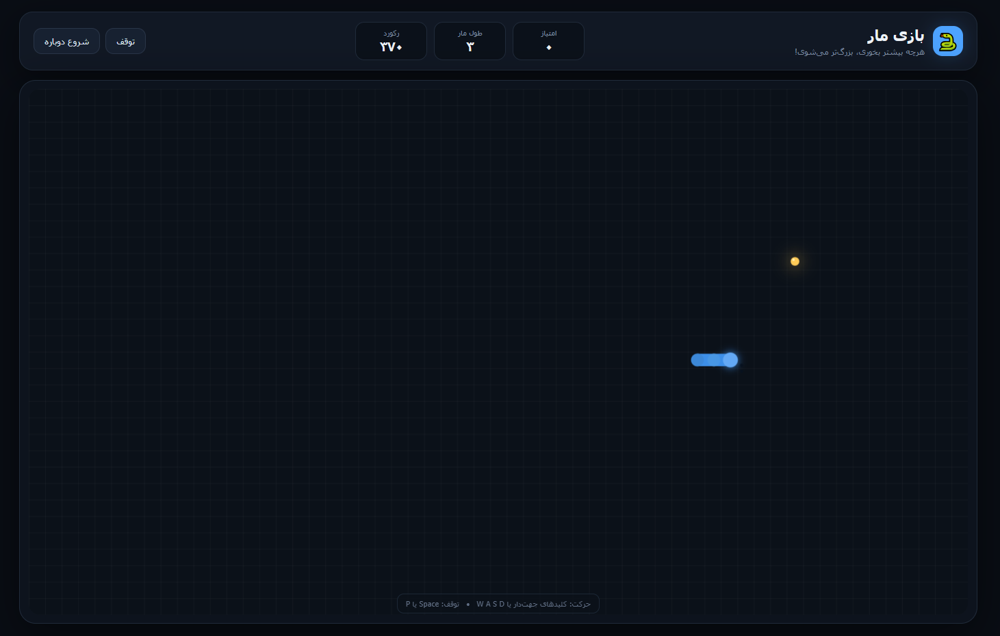

# 🐍 مار (Snake)

یک بازآفرینی مدرن، روان و مینیمال از بازی خاطره‌انگیز «مار» (Snake) مبتنی بر وب با رابط کاربری کاملاً فارسی و بهینه‌سازی‌شده برای دسکتاپ. این پروژه بدون هیچ فریم‌ورک خارجی و با استفاده از **Vanilla JavaScript** و **HTML5 Canvas** پیاده‌سازی شده است.

🎮 **[اجرای آنلاین و تجربه بازی](https://IamMFK.github.io/snake/)**

> ⚠️ **توجه:** این بازی مخصوص **کامپیوتر و لپ‌تاپ (Desktop Only)** طراحی شده است و به کیبورد و ماوس نیاز دارد. در حال حاضر نسخه لمسی/موبایل ندارد.

### 🖼️ پیش‌نمایش بازی

  

## ✨ ویژگی‌های کلیدی (Features)

- **گرافیک مدرن و روان (Modern Aesthetics):**
  - رندرینگ روان روی عنصر `<canvas>` با بهره‌گیری از `requestAnimationFrame`.
  - افکت درخشش نئونی (Glow Effect) برای سیب و سر مار.
  - سیستم ذرات انفجاری (Particle System) اختصاصی در لحظه خوردن طعمه.
  - پشتیبانی از **Device Pixel Ratio (HiDPI / Retina)** جهت جلوگیری از مات شدن گرافیک و خطوط شبکه (Grid).
- **مکانیک بازی و پیشرفت سختی (Dynamic Difficulty):**
  - سرعت گام‌ها از ۱۱۲ میلی‌ثانیه شروع شده و به ازای هر ۳۰ امتیاز افزایش می‌یابد (تا سقف سرعت ۵۵ میلی‌ثانیه).
  - جلوگیری از چرخش معکوس ۱۸۰ درجه آنی و خودکشی ناخواسته در یک فریم.
- **رابط کاربری و بومی‌سازی (UI / UX):**
  - طراحی مدرن با تم تاریک (Dark Mode Glassmorphism).
  - تبدیل اعداد و شمارنده‌ها به ارقام فارسی (`fa-IR`).
  - ذخیره‌سازی بالاترین امتیاز (High Score) در مرورگر کاربر از طریق `localStorage`.
  - تشخیص ابعاد صفحه نمایش و نمایش پیام بهینه‌سازی برای نمایشگرهای دسکتاپ.

---

## 🎮 کنترل‌های بازی (Controls)

| کلیدها | عملکرد |
| :--- | :--- |
| **Arrow Keys** (کلیدهای جهت‌نما) یا **W, A, S, D** | تغییر جهت حرکت مار |
| **Space** یا **P** | توقف موقت (Pause) / ادامه بازی |
| **R** | راه‌اندازی مجدد فوری (Restart) |

> دکمه‌های کنترل و مدیریت بازی روی رابط کاربری نیز جهت استفاده با ماوس تعبیه شده‌اند.

---

## 🛠️ تکنولوژی‌های به‌کاررفته (Tech Stack)

- **HTML5:** ساختار معنایی و بوم گرافیکی (`<canvas>`).
- **CSS3:** چیدمان مدرن با Flexbox، استایل‌های Glassmorphism و واکنش‌گرایی مدیاکوئری.
- **Vanilla JavaScript (ES6+):**
  - مدیریت چرخه حیات بازی (Game Loop) با گام‌های زمانی مبتنی بر `timestamp`.
  - محاسبات برداری ۲ بعدی و مدیریت برخورد (AABB Grid Collision).
  - انیمیشن فیزیک ذرات با محوشدگی تدریجی (Alpha Fading).

---

## 🚀 اجرای لوکال

برای اجرای بازی نیاز به هیچ بیلدتول، پکیج منیجر یا سروری نیست.

کافیست فایل `index.html` را در هر مرورگری اجرا کنید یا ریپازیتوری را کلون نمایید
